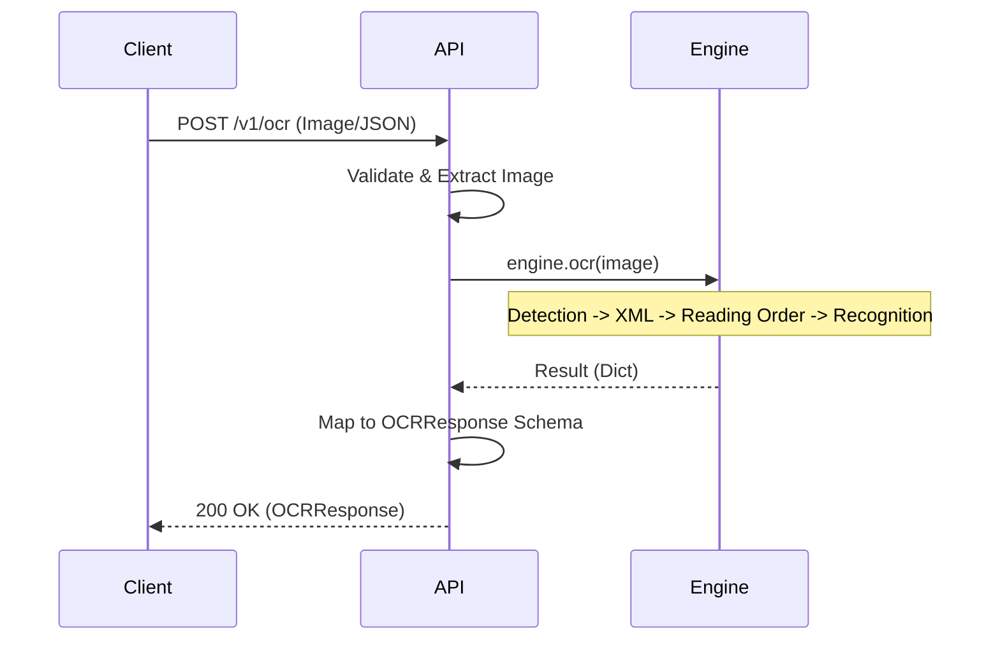
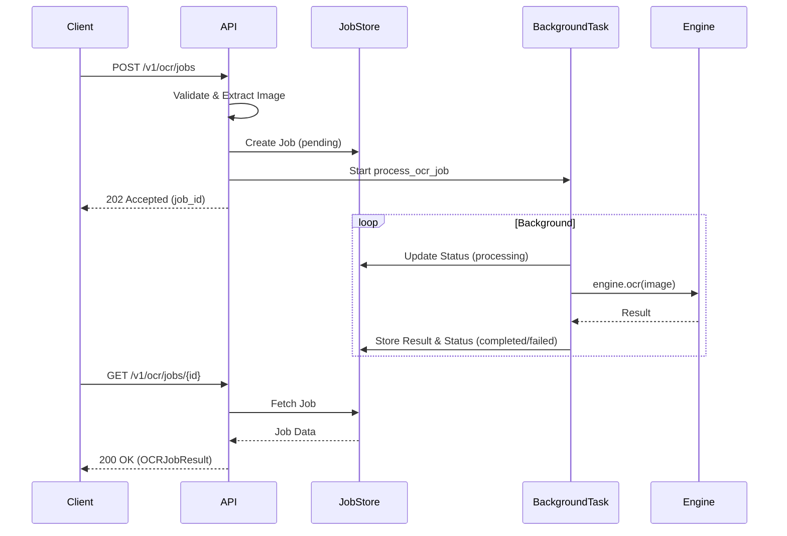
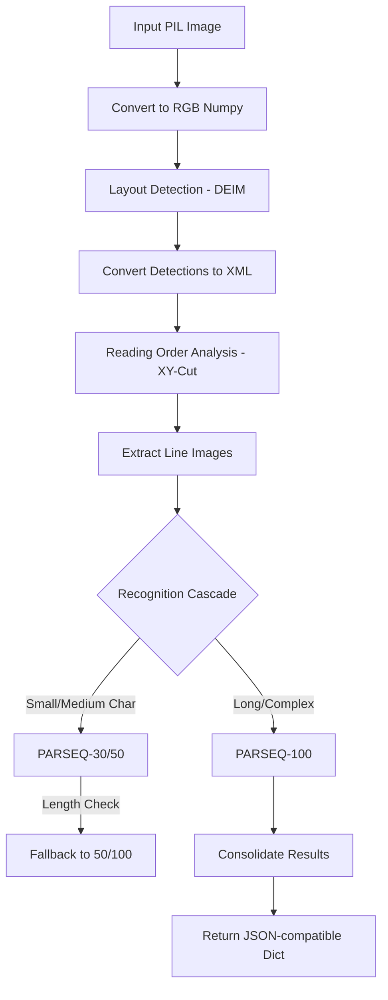

# Architecture Documentation

This document describes the architecture and data flow of the NDLOCR-Lite API.

## System Overview

The system is a FastAPI-based wrapper around the [NDLOCR-Lite](https://github.com/ndl-lab/ndlocr-lite) engine. It provides a RESTful API for both synchronous and asynchronous OCR processing, following an OpenAI-compatible response schema.

### Components

1.  **FastAPI Application (`src/api/main.py`)**: Handles HTTP requests, authentication (if any), input validation, and job orchestration.
2.  **NDLOCR Engine (`src/core/engine.py`)**: Wraps the underlying OCR models and logic. It manages model loading (ONNX), detection, reading order analysis, and character recognition.
3.  **Job Store (`InMemoryJobStore`)**: A simple in-memory storage for tracking the status and results of background OCR jobs.
4.  **NDLOCR-Lite (Submodule)**: The core OCR engine provided by NDL, including models for layout detection and character recognition.

---

## High-Level Architecture

```mermaid
graph TD
    Client[Client]
    API[FastAPI /v1/ocr]
    Engine[NDLOCR Engine]
    Sub[NDLOCR-Lite Submodule]
    JS[InMemoryJobStore]

    Client -->|POST /v1/ocr| API
    Client -->|POST /v1/ocr/jobs| API
    Client -->|GET /v1/ocr/jobs/{id}| API

    API -->|sync/async call| Engine
    API <-->|read/write| JS

    Engine -->|uses| Sub
```

---

## Detailed Data Flows

### 1. Synchronous OCR Flow (`POST /v1/ocr`)



### 2. Asynchronous OCR Job Flow (`POST /v1/ocr/jobs`)



### 3. Engine OCR Pipeline (`NDLOCREngine.ocr`)

The engine processes images in the following stages:



---

## Technical Details

### Security Measures
- **Input Validation**: Strict limits on image dimensions and file sizes.
- **XXE Protection**: Uses `defusedxml` for all XML parsing to prevent XML-based attacks.
- **Sanitization**: Image filenames are sanitized before being processed in internal XML structures.

### Performance Optimization
- **Model Caching**: Models are loaded once during the FastAPI lifespan and shared across requests.
- **Parallel Recognition**: Line-level recognition is parallelized using a `ThreadPoolExecutor` within the engine.
- **Recognition Cascade**: Uses smaller, faster models for simple cases and cascades to larger models only when necessary.
